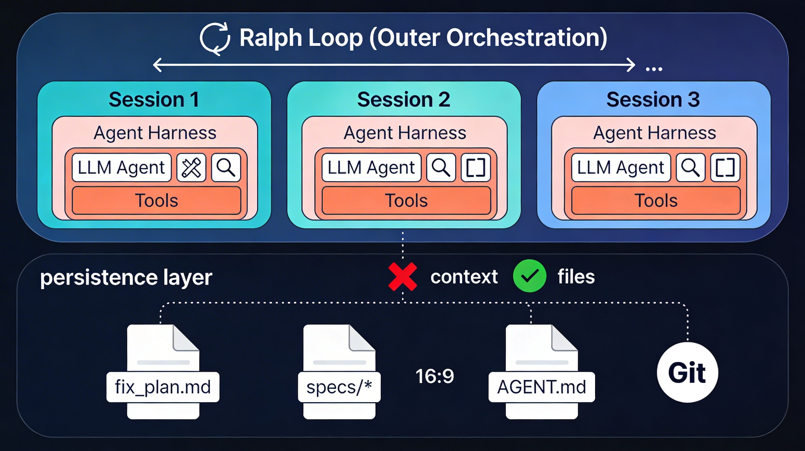
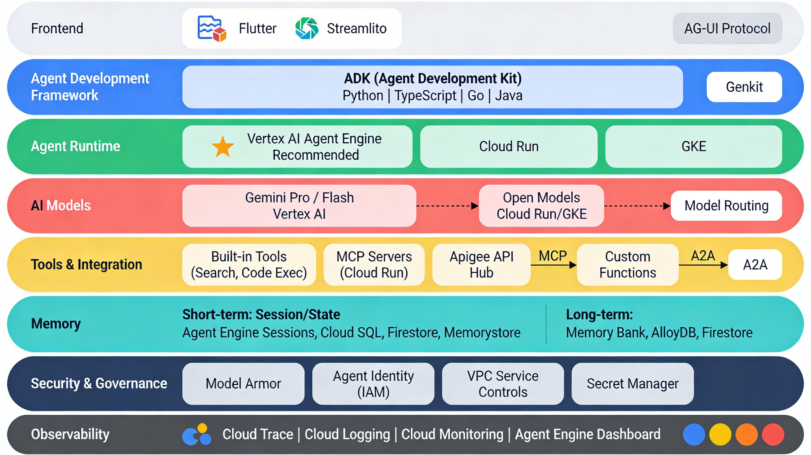

# Agent Harness와 Ralph Loop: 개념부터 Google Cloud 구현까지

## Part 1. Agent Harness와 Ralph Loop

## 1. Agent Harness란 무엇인가

**Agent Harness는 AI 모델(LLM)을 감싸는 인프라스트럭처 소프트웨어 시스템**으로, 에이전트가 현실 세계에서 신뢰성 있게 작동할 수 있도록 도구 제공, 컨텍스트 관리, 안전 장치, 워크플로우 구조를 제공합니다. 핵심은 에이전트 자체(두뇌)가 아니라 **에이전트가 동작하는 몸체(body)** 라는 점입니다.

LangChain의 Harrison Chase는 AI 에이전트 생태계를 세 가지 계층으로 분류합니다:

| 계층 | 역할 | 예시 |
|------|------|------|
| **Agent Framework** | 추상화·빌딩블록 제공 | LangChain, Vercel AI SDK, <br/>Google ADK |
| **Agent Runtime** | 내구성 실행, 스트리밍, 상태 영속성 | LangGraph, Temporal, Inngest, <br/>Google Cloud Run, Google Kubernetes Engine, Vertex Agent Engine |
| **Agent Harness** | 배터리 포함(batteries included), 프롬프트·도구·계획 기본 탑재 | DeepAgents, Claude Agent SDK, <br>Vertex Memory Bank + Google ADK Memory Tools + Agent Engine|

Agent Harness는 이 중 **가장 상위 레벨**에 위치하며, 프레임워크 위에 구축되어 기본 프롬프트, 파일시스템 접근, 서브에이전트 관리, 도구 호출의 의견이 반영된(opinionated) 처리를 제공합니다. 자동차에 비유하면, 에이전트가 엔진이라면 하네스는 핸들·브레이크·내비게이션·연료 시스템을 포함한 **자동차 전체**입니다.

### Agent Harness의 핵심 기능

- **도구 통합 레이어(Tool Integration):** 웹 검색, 코드 실행, DB 쿼리, 이미지 생성 등 외부 도구를 LLM에 연결하고, 모델의 도구 호출을 감지·실행·결과 반환
- **컨텍스트 관리 & 메모리:** 세션 내 대화 이력, 컨텍스트 압축(compaction), 작업 로그 관리
- **오케스트레이션:** 사용자 목표를 하위 작업으로 분해하고, 각 단계에서 모델에 필요한 컨텍스트와 도구를 제공
- **신뢰성 & 안전 장치:** 진행 상태 저장, 오류 복구, 유해 출력 필터링, 사용자 확인 요청

***

## 2. Ralph Loop란 무엇인가


**Ralph Loop(Ralph Wiggum Technique)** 은 AI 에이전트를 활용한 장기 실행 자율 작업을 위한 오케스트레이션 기법입니다. Geoffrey Huntley가 개발·대중화했으며, *The Simpsons*의 캐릭터 Ralph Wiggum에서 이름을 따왔습니다.

Ralph Wiggum은 사랑스럽지만 건망증이 심하고, 열정적이지만 실수를 반복하는 캐릭터입니다. AI 에이전트도 마찬가지입니다. **이전 시도를 기억하지 못하고, 같은 실수를 반복합니다.** Ralph Loop의 해법은 이 한계를 극복하려 하지 않고 **받아들이는 것**입니다.

### 가장 순수한 형태

```bash
while :; do cat PROMPT.md | claude-code ; done
```

이 한 줄의 bash 루프가 Ralph의 본질입니다. **매 반복마다 새로운 세션(fresh context)** 을 시작하고, **파일 시스템을 통한 외부 메모리** 로 세션 간 연속성을 유지합니다.

### Ralph Loop의 핵심 원리

**① Fresh Context Per Iteration (매 반복 새 컨텍스트)**
가장 중요한 원칙입니다. 각 반복이 완전히 새로운 세션으로 시작되므로 **Context Rot**(컨텍스트 창에 불필요하거나 충돌하는 정보가 쌓여 출력 품질이 저하되는 현상)을 완전히 회피합니다.<br/>
Michael Arnaldi의 경고: *"에이전트 하네스 안에서 Ralph를 skill/command로 구현한다면, Ralph의 핵심을 놓치고 있는 것"*

**② 파일 기반 외부 메모리**
세션 간 기억은 오직 파일로 전달됩니다:

| 파일 | 역할 |
|------|------|
| `PROMPT.md` | 매 반복 에이전트에 전달되는 지시사항 |
| `specs/*` | 기능별 사양 문서 (요구사항의 진실 소스) |
| `fix_plan.md` | 동적 작업 추적기 (할 일, 발견된 버그, 완료 항목) |
| `AGENT.md` | 프로젝트 컨벤션과 행동 가이드 ("표지판") |

**③ 루프당 하나의 작업(One Item Per Loop)**
컨텍스트 윈도우를 보존하기 위해 한 번의 반복에서 **하나의 작업만** 수행합니다.

**④ Backpressure(역압)**
에이전트의 출력을 검증하고 수정을 강제하는 메커니즘입니다. 타입 시스템, 테스트, 린터, 보안 스캐너 등이 이에 해당하며, 이 검증 휠이 빠르게 돌수록 더 많은 반복이 가능합니다.

**⑤ Planning Mode vs Build Mode**
Planning Mode에서 모든 사양을 읽고 `fix_plan.md`를 생성한 뒤, Build Mode에서 항목을 하나씩 구현하는 린(lean) 루프를 반복합니다.

***

## 3. 두 개념의 관계

### 계층적 관계: Ralph Loop는 Agent Harness 위에서 동작한다

Ralph Loop와 Agent Harness는 **경쟁 관계가 아니라 상호 보완적인 계층 관계**입니다.

```
┌─────────────────────────────────────────────────────────────┐
│  Ralph Loop (외부 오케스트레이션 - bash while loop)           │
│  ┌──────────┐   ┌──────────┐   ┌──────────┐               │
│  │ Session 1 │──▶│ Session 2 │──▶│ Session 3 │──▶ ...      │
│  │┌────────┐│   │┌────────┐│   │┌────────┐│               │
│  ││ Agent  ││   ││ Agent  ││   ││ Agent  ││               │
│  ││Harness ││   ││Harness ││   ││Harness ││               │
│  ││ ┌────┐ ││   ││ ┌────┐ ││   ││ ┌────┐ ││               │
│  ││ │LLM │ ││   ││ │LLM │ ││   ││ │LLM │ ││               │
│  ││ │+Tool│ ││   ││ │+Tool│ ││   ││ │+Tool│ ││               │
│  ││ └────┘ ││   ││ └────┘ ││   ││ └────┘ ││               │
│  │└────────┘│   │└────────┘│   │└────────┘│               │
│  └──────────┘   └──────────┘   └──────────┘               │
│        ❌ context        ❌ context                         │
│        ✅ files          ✅ files                           │
├─────────────────────────────────────────────────────────────┤
│  [영속 계층] Git commits │ fix_plan.md │ specs/* │ AGENT.md │
└─────────────────────────────────────────────────────────────┘
```

ZeroSync의 용어집이 이 관계를 명확하게 정리합니다: *"Agent Harness: LLM API 호출을 감싸는 프로그램. 하네스는 세션, 도구, 오케스트레이션을 관리한다. '같은 에이전트'라 할 때, 같은 하네스를 의미하지만 매 루프는 새로운 세션을 생성한다"*.

| 관점 | Agent Harness | Ralph Loop |
|------|--------------|------------|
| **본질** | 인프라/소프트웨어 시스템 | 오케스트레이션 패턴/기법 |
| **범위** | 단일 세션 내부 | 세션 간(cross-session) |
| **컨텍스트** | 세션 내 컨텍스트 관리·압축 | 매 반복 fresh context 보장 |
| **메모리** | 세션 내 메모리 관리 | 파일 기반 외부 메모리 (git, MD 파일) |
| **도구** | 도구 제공·실행·결과 반환 | 도구를 직접 제공하지 않음 |
| **구현** | SDK, 라이브러리 | bash while loop (단순) |
| **비유** | 자동차 전체 (핸들, 브레이크, 내비) | 운행 스케줄 (매일 새 운전자, 운행일지 인수인계) |

### Anthropic의 사례: 두 개념의 실제 결합

Anthropic은 Claude Agent SDK(Agent Harness)를 활용하면서, 사실상 Ralph Loop와 동일한 패턴을 공식화했습니다:

- **Initializer Agent** = Ralph의 Planning Mode → 환경 설정, 기능 목록(feature_list.json) 작성, init.sh 스크립트 생성
- **Coding Agent** = Ralph의 Build Mode → 매 세션 `claude-progress.txt`와 git log를 읽고, 하나의 기능 구현 후 커밋
- `feature_list.json` = Ralph의 `specs/*`, `claude-progress.txt` = Ralph의 `fix_plan.md`

이 접근법으로 발견한 핵심 교훈은 Ralph Loop의 원칙과 정확히 일치합니다: **한 번에 하나의 기능만 구현**, **매 세션 클린 상태로 종료**, **진행 파일과 git으로 다음 세션에 인수인계**.

***

## 4. 활용 방안

### 방안 1: 대규모 소프트웨어 프로젝트 자율 개발

[Geoffrey Huntley](https://ghuntley.com/ralph/)는 Ralph Loop로 **CURSED**라는 프로그래밍 언어를 3개월간 자율 운영하여 완성했습니다. LLM 학습 데이터에 없는 언어의 컴파일러(렉서, 파서, LLVM 코드젠, 표준 라이브러리)를 구축한 사례입니다. Y Combinator 해커톤에서는 6개 저장소를 하룻밤에 배포하고, 약 $297의 API 비용으로 $50,000 상당의 작업을 완료했습니다.

**구현 방법:**
- Agent Harness(Claude Agent SDK 또는 DeepAgents)로 코드 실행, 웹 검색, 파일 시스템 접근 제공
- Ralph Loop으로 외부 bash 루프를 돌리며 매 세션 fresh context 보장
- `specs/` 디렉토리에 기능별 사양서를 작성하고, `fix_plan.md`로 진행 상황 추적

### 방안 2: IaC(Infrastructure as Code) 자동화

클라우드 인프라 코드(Terraform, Pulumi 등)를 Ralph Loop로 반복 개선할 수 있습니다.

- **Planning Mode:** 아키텍처 요구사항을 specs로 작성 → 인프라 구현 계획 생성
- **Build Mode:** 매 반복 하나의 리소스(VPC, 서브넷, GKE 클러스터 등) 구현 → `terraform validate` + `terraform plan`을 backpressure로 활용
- Agent Harness가 클라우드 API 문서 검색, 코드 실행, 보안 스캔 도구 제공

### 방안 3: CI/CD 파이프라인과 통합한 지속적 코드 품질 개선

Ralph Loop의 backpressure 메커니즘을 기존 CI/CD와 연결하면 강력한 자동화가 가능합니다.

- 테스트 실패 → Ralph가 자동으로 수정 시도 → 재테스트 → 통과 시 커밋
- 린터/타입체커 경고 → 자동 수정 루프
- 보안 스캐너 발견 사항 → 자동 패치 생성

### 방안 4: 멀티 에이전트 병렬 처리

Ralph Loop는 두 가지 형태의 병렬성을 지원합니다:

- **Subagent(세션 내 병렬):** 메인 Ralph의 컨텍스트 윈도우를 소비하지 않는 읽기 전용 하위 프로세스 (파일 검색, 테스트 실행, 문서 업데이트)
- **Multiple Loops(세션 간 병렬):** VM, 컨테이너, git worktree로 격리된 독립 Ralph 루프를 동시 실행

이를 활용하면 마이크로서비스 아키텍처의 각 서비스를 별도 Ralph Loop으로 동시 개발할 수 있습니다.

### 방안 5: 비코딩 영역으로의 확장

Anthropic이 언급한 것처럼, 이 패턴은 코딩을 넘어 **과학 연구, 금융 모델링, 기술 문서 작성** 등 장기 실행이 필요한 모든 에이전트 작업에 일반화할 수 있습니다. 예를 들어:

- **리서치 에이전트:** specs에 연구 질문 정의 → 매 반복 하나의 논문/데이터소스 분석 → fix_plan.md에 발견 사항 누적
- **투자 분석 에이전트:** specs에 분석 프레임워크 정의 → 매 반복 하나의 기업/지표 분석 → 최종 보고서 자동 생성

***

## 5. Part 1 핵심 요약



Agent Harness는 개별 세션의 **"품질"** 을 보장하고, Ralph Loop는 세션 간의 **"연속성과 진행"** 을 보장합니다. 이 둘은 서로 다른 계층에서 동작하는 보완적 개념입니다.

> *"오케스트레이션은 작전의 두뇌이고, 하네스는 손과 인프라다. 둘 다 복잡한 AI 에이전트에 필수적이다."* — Parallel AI

> *"Ralph는 결정론적으로 나쁘다, 비결정론적 세계에서. Ralph의 실패는 예측 가능한 패턴을 따르며, 이 한계의 예측 가능성이야말로 유용한 이유다."* — Geoffrey Huntley

가장 강력한 활용은 이 두 개념을 **의도적으로 분리하되 함께 사용하는 것**입니다.<br/>
Agent Harness 안에서 Ralph를 구현하면 fresh context라는 핵심 원칙이 깨지고, Ralph 없이 Harness만 사용하면 장기 작업에서 context rot와 조기 완료 선언이라는 실패 모드에 빠집니다. 둘의 올바른 결합이 신뢰할 수 있는 장기 자율 AI 작업의 열쇠입니다.

### References
- [1] What is an agent harness in the context of large-language models? https://parallel.ai/articles/what-is-an-agent-harness
- [2] Agent vs Harness: What's the Difference? Ezz's Blog | Ezz's Blog https://ezz.sh/posts/agent_vs_harness
- [3] Agent Frameworks, Runtimes, and Harnesses- oh my! https://blog.langchain.com/agent-frameworks-runtimes-and-harnesses-oh-my/
- [4] The importance of Agent Harness in 2026 - Philschmid https://www.philschmid.de/agent-harness-2026
- [5] Effective harnesses for long-running agents - Anthropic https://www.anthropic.com/engineering/effective-harnesses-for-long-running-agents
- [6] The Ralph Loop: Long-Running AI Agents | ZeroSync Blog http://www.zerosync.co/blog/ralph-loop-technical-deep-dive
- [7] Ralph Wiggum - Viral Agentic Coding Loop, Simplified https://ralph-wiggum.ai
- [8] ralph-loop-agent - Continuous Autonomy for the AI SDK - GitHub https://github.com/vercel-labs/ralph-loop-agent
- [9] Ralph Loop Revolutionizes AI Coding with Autonomous ... https://www.linkedin.com/posts/rakeshgohel01_have-you-ever-tried-using-coding-ai-agents-activity-7414649482870665217-O6LF
- [11] Ralph Mode for Deep Agents: Running an Agent Forever https://www.youtube.com/watch?v=yi4XNKcUS8Q
- [12] Ralph Loop, OpenClaw - 새로운건 없었다 https://channel.io/ko/team/blog/articles/tech-ralph-loop-openclaw-9a2e654c
- [13] 코딩 에이전트의 결과물을 개선하는 Ralph 방법론의 소개 및 ... https://discuss.pytorch.kr/t/ralph-playbook-ralph/8705
- [14] truly the ultimate ralph loop explainer https://x.com/round/status/2011926496730886407
- [15] Understanding Agent Frameworks, Runtimes & Harnesses in Modern AI Systems https://www.youtube.com/watch?v=inVO14Tabn4
- [16] WTF is a Ralph Loop? - Best AI Coding Agent Ever? https://www.youtube.com/watch?v=2ItHHAKO4T0

<br>

---

<br>

## Part 2. Google Cloud 기반 Agent Harness 구현 방안

### 개요: Google Cloud 서비스 매핑

이제 Agent Harness와 Ralph Loop의 개념적 정의를 바탕으로, 이를 Google Cloud 환경에서 실제로 어떻게 구성하고 구현하는지 살펴보겠습니다.

Agent Harness는 LLM 에이전트를 감싸는 인프라 시스템으로, 도구 통합·컨텍스트 관리·메모리·보안·오케스트레이션을 제공합니다. Google Cloud는 이를 구현하기 위한 포괄적인 서비스 스택을 보유하고 있으며, 핵심 축은 **ADK(Agent Development Kit)** + **Vertex AI Agent Engine** + **MCP/A2A 프로토콜** 조합입니다.

Google Cloud의 Agent Harness는 8개 계층으로 구성됩니다. 아래에서 각 계층을 상세히 검토합니다.




***

## 1계층: Google ADK (Agent Development Framework)

**ADK(Agent Development Kit)** 는 Google이 제공하는 오픈소스 에이전트 개발 프레임워크로, 누적 700만+ 다운로드를 기록하고 있습니다. Agent Harness를 코드로 정의하는 핵심 도구입니다.

### 핵심 특성

- **Code-first**: 에이전트 로직, 도구, 오케스트레이션을 코드로 직접 정의하여 테스트·버전관리 용이
- **Model-agnostic**: Gemini 최적화이나 다른 LLM도 지원
- **Deployment-agnostic**: Agent Engine, Cloud Run, GKE 어디든 배포 가능
- **Multi-language**: Python, TypeScript, Go, Java 지원

### ADK 프로젝트 구조

```
parent_folder/
├── requirements.txt          # google-adk
└── my_agent/
    ├── __init__.py            # from . import agent
    ├── agent.py               # root_agent 정의
    └── .env                   # API keys, PROJECT_ID
```

`agent.py`에서 `root_agent`를 정의하면 ADK가 이를 인식하여 실행합니다.

### ADK 핵심 추상화

| 개념 | 역할 |
|------|------|
| **Agent** | LLM + 지시사항 + 도구 + 서브에이전트를 하나로 묶는 단위 |
| **Session** | 사용자와 에이전트 간 대화 스레드 |
| **Event** | 세션 내 개별 상호작용 (메시지, 도구 호출 등) |
| **State** | 세션 내 key-value 스크래치패드 |
| **Runner** | 에이전트를 세션 컨텍스트에서 실행하는 엔진 |

State에는 네 가지 스코프가 존재합니다:
- `state["key"]` — 세션 스코프 (현재 대화만)
- `state["user:key"]` — 유저 스코프 (동일 유저의 모든 세션에서 공유)
- `state["app:key"]` — 앱 스코프 (전체 사용자 공유)
- `state["temp:key"]` — 임시 (턴 종료 시 삭제)

***

## 2계층: Agent Runtime — 실행 환경 선택

에이전트 코드가 실행되는 컴퓨트 환경입니다. 세 가지 선택지가 있으며, 요구사항에 따라 선택이 달라집니다.

| 기준 | Vertex AI Agent Engine ⭐ | Cloud Run | GKE |
|------|--------------------------|-----------|-----|
| **관리 오버헤드** | 최소 (fully managed) | 낮음 (serverless) | 높음 (클러스터 관리) |
| **언어 지원** | Python 전용 | Any (컨테이너) | Any (컨테이너) |
| **내장 메모리** | ✅ (세션, Memory Bank) | ❌ (외부 필요) | ❌ (외부 필요) |
| **자동 스케일링** | ✅ (Cloud Run 기반) | ✅ (0까지 축소) | ✅ (노드풀 단위) |
| **최대 요청 시간** | 관리형 | 1시간 | 무제한 |
| **MCP 서버 호스팅** | ❌ | ✅ | ✅ |
| **상태 관리** | 내장 세션 서비스 | Stateless (외부 필요) | StatefulSets 가능 |
| **배포 방법** | `adk deploy cloud_run` 또는 SDK | `gcloud run deploy` | `kubectl apply` |
| **추천 시나리오** | Python 에이전트, 빠른 프로덕션 | 다국어, 서버리스, 비용 최적화 | 복잡한 stateful, 보안 격리 |

### 배포 명령 예시

**Agent Engine 배포 (SDK)**:
```python
from vertexai import agent_engines
agent_engine = agent_engines.create(
    agent=my_adk_app,
    requirements=["google-adk"],
    display_name="my-agent"
)
```

**Cloud Run 배포 (CLI)**:
```bash
adk deploy cloud_run \
  --project=$PROJECT_ID \
  --region=us-central1 \
  --with-ui
```

**권장 선택:** 대부분의 경우 **Vertex AI Agent Engine**을 우선 고려합니다.<br/>
Python 에이전트에 최적화되어 있으며, 세션 관리·메모리·스케일링·보안이 내장되어 운영 부담이 최소화됩니다.

***

## 3계층: AI Models — 추론 엔진

에이전트의 두뇌 역할을 하는 모델 선택입니다. Google Cloud에서는 **Model Routing** 전략을 권장합니다.

| 모델 | 입력 가격 ($/1M tokens) | 출력 가격 ($/1M tokens) | 추천 용도 |
|------|----------------------|----------------------|----------|
| **Gemini 2.5 Pro** | $1.25 (≤200K) / $2.25 (>200K) | $10 / $15 | 복잡한 추론, 멀티스텝 계획 |
| **Gemini 2.5 Flash** | $0.30 | $2.5 / $2.5 | 일반 작업, 비용 최적화 |
| **Open Models** (Gemma 등) | Cloud Run/GKE 컴퓨트 비용 | - | 데이터 레지던시, 커스텀 파인튜닝 |
[Cost of building and deploying AI models in Vertex AI](https://cloud.google.com/vertex-ai/generative-ai/pricing)

**Model Routing 전략:**
- 간단한 요청 (분류, 번역) → Gemini Flash 또는 SLM
- 복잡한 추론 (다단계 계획, 코드 생성) → Gemini Pro
- 특수 보안/데이터 요건 → Self-hosted open model on GKE

Gemini Pro/Flash의 **thinking budget** 조절로 추론 깊이 vs 비용/지연 시간 트레이드오프를 최적화할 수 있습니다.

***

## 4계층: Tool Integration — 에이전트의 손

에이전트의 외부 세계 상호작용 능력을 결정하는 계층입니다. 네 가지 패턴을 조합합니다.

### (A) Built-in Tools
ADK에 내장된 도구들로, 별도 설정 없이 즉시 사용 가능합니다:
- **Google Search**: 실시간 웹 정보 접근
- **Code Execution**: 보안 샌드박스에서 코드 실행
- **RAG**: 엔터프라이즈 데이터에서 정보 검색
- **Database Query**: 클라우드 DB 구조화 데이터 접근

### (B) MCP 서버 (Cloud Run 호스팅)
MCP(Model Context Protocol)는 에이전트-도구 간 표준 인터페이스입니다. Cloud Run에 커스텀 MCP 서버를 배포하여 에이전트에 도구를 노출합니다:

```bash
# MCP 서버 Cloud Run 배포
gcloud run deploy mcp-server \
  --image us-central1-docker.pkg.dev/$PROJECT_ID/mcp-servers/my-server:latest \
  --region=us-central1 \
  --no-allow-unauthenticated
```

Agent Engine에 MCP를 배포할 때는 **build-time installation** 패턴을 사용합니다. 커스텀 설치 스크립트로 빌드 시점에 MCP 서버 의존성을 컨테이너 이미지에 포함시킵니다.

### (C) Apigee API Hub
대규모 엔터프라이즈에서 수많은 API 기반 도구를 관리할 때 사용합니다. 인증, 레이트 리미팅, 모니터링을 중앙에서 관리합니다.

### (D) Custom Function Tools
사내 API나 특수 비즈니스 로직을 Python 함수로 정의하여 에이전트에 제공합니다.

### 통신 프로토콜 요약

| 프로토콜 | 용도 | 표준 |
|----------|------|------|
| **MCP** | 에이전트 ↔ 도구 | Open standard (Anthropic 주도) |
| **A2A** | 에이전트 ↔ 에이전트 | Open standard (Google 주도) |
| **AG-UI** | 에이전트 ↔ 프론트엔드 | Open standard |

***

## 5계층: Memory — 상태 영속성

### Short-term Memory (단기 메모리)

| 구현 옵션 | 환경 | 특성 |
|-----------|------|------|
| `InMemorySessionService` | 개발/테스트 | 인스턴스 재시작 시 소실 |
| `DatabaseSessionService` (Cloud SQL) | 프로덕션 | 수평 스케일링 가능, ADK 네이티브 |
| Firestore | 프로덕션 | 서버리스, 자동 스케일링 |
| Memorystore (Redis) | 프로덕션 | 초저지연, 캐시 적합 |
| Agent Engine Sessions | 프로덕션 | Agent Engine에 내장, 관리 불필요 |

**핵심 설계 원칙:** 프로덕션에서는 반드시 **stateless agent application + 외부 상태 저장소** 패턴을 사용합니다. 어떤 인스턴스든 어떤 사용자 요청이든 처리할 수 있어야 합니다.

### Long-term Memory (장기 메모리)

- **Memory Bank**: Google Cloud의 관리형 장기 메모리 서비스. Agent Engine, Cloud Run, GKE 어디서든 사용 가능
- **Firestore / AlloyDB**: 커스텀 지식 베이스 구축 시
- **Vertex AI Search**: RAG 기반 엔터프라이즈 지식 검색

***

## 6계층: Security & Governance — 안전장치

Agent Harness의 가드레일 역할을 하는 핵심 계층입니다.

| 서비스 | 역할 | 적용 범위 |
|--------|------|----------|
| **Model Armor** | 프롬프트 인젝션 차단, 유해 콘텐츠 필터링, 민감 데이터 유출 방지 | Vertex AI, GKE |
| **Agent Identity (IAM)** | 에이전트별 고유 Cloud IAM ID 부여, 최소 권한 원칙 적용 | 모든 런타임 |
| **VPC Service Controls** | 네트워크 수준 격리, 데이터 유출 방지 | 엔터프라이즈 |
| **Secret Manager** | API 키, 자격증명 안전 저장 | 모든 런타임 |
| **GKE Sandbox** | 신뢰할 수 없는 코드 격리 실행 | GKE |
| **Agent Engine Code Execution** | 안전한 샌드박스 코드 실행 | Agent Engine |

Google은 **결정론적 보안 제어 + 동적 추론 기반 방어**의 결합을 권장하며, 세 가지 핵심 원칙을 제시합니다: **사람의 감독(human oversight), 신중히 정의된 에이전트 자율성, 관측 가능성(observability)**.

***

## 7계층: Observability — 모니터링 & 디버깅

| 도구 | 기능 |
|------|------|
| **Cloud Trace** | 에이전트 워크플로우 내 에러 추적, 지연 시간 분석 |
| **Cloud Logging** | 에이전트 로그 중앙 수집 |
| **Cloud Monitoring** | 메트릭 대시보드, 알림 설정 |
| **Agent Engine Dashboard** | 토큰 사용량, 지연 시간, 에러율 실시간 추적 |
| **Managed Prometheus** (GKE) | 서드파티·커스텀 메트릭 수집 |

ADK에는 **built-in tracing**이 내장되어 있어, 에이전트의 추론 경로와 도구 호출 체인을 시각적으로 디버깅할 수 있습니다.

***

## 8계층: Multi-Agent 패턴 — 고급 구성

복잡한 작업에는 단일 에이전트로 충분하지 않습니다. Google Cloud는 A2A 프로토콜을 통한 멀티에이전트 시스템을 공식 지원합니다.

### 지원되는 디자인 패턴

- **Sequential Pattern**: 에이전트 A → 에이전트 B → 에이전트 C 순차 실행
- **Iterative Refinement**: 작업 에이전트 → 품질 평가 에이전트 → 프롬프트 개선 → 재시도
- **Coordinator Pattern**: 코디네이터 에이전트가 전문 서브에이전트에 위임
- **Human-in-the-Loop**: 중요 결정에서 인간 개입 경로 제공

### 실제 활용 사례 (Google 공식 레퍼런스)

| 유스케이스 | 에이전트 구성 |
|-----------|-------------|
| **금융 어드바이저** | 데이터 수집 → 분석 → 추천 → 거래 실행 (Sequential) |
| **리서치 어시스턴트** | 계획 → 조사 → 평가 → 보고서 작성 (Sequential + Iterative) |
| **공급망 최적화** | 재고관리 + 배송추적 + 공급자 커뮤니케이션 (Coordinator) |

***

## 실전 구성 시나리오: 3-Tier 접근

### Tier 1: 프로토타이핑 (비용 최소화)

```
ADK (Python) + Gemini Flash
├── InMemorySessionService
├── Built-in Tools (Google Search)
├── ADK Dev UI (local: adk web)
└── 배포: adk deploy cloud_run --with-ui
```
- **비용**: Gemini API 사용량만 (pay-per-use)
- **소요 시간**: 30분 이내 구축 가능
- **적합**: PoC, 내부 데모, 해커톤

### Tier 2: 프로덕션 단일 에이전트

```
ADK (Python) + Gemini Pro (추론) / Flash (단순작업)
├── Vertex AI Agent Engine Runtime
├── Agent Engine Sessions (단기) + Memory Bank (장기)
├── MCP 서버 on Cloud Run (커스텀 도구)
├── Model Armor + Agent Identity (IAM)
├── Cloud Trace + Monitoring
└── 배포: agent_engines.create() via SDK
```
- **비용**: Agent Engine ~$0.0864/vCPU-hr + 모델 사용량
- **적합**: 고객 서비스 봇, 내부 업무 자동화, RAG 어시스턴트

### Tier 3: 엔터프라이즈 멀티에이전트

```
ADK + A2A + MCP
├── Coordinator Agent + 전문 Subagents
├── GKE 또는 Agent Engine (하이브리드)
├── Apigee API Hub (엔터프라이즈 API 관리)
├── AlloyDB/Firestore (메모리) + Vertex AI Search (RAG)
├── Model Routing (Pro + Flash + Open Models)
├── Full Governance: Model Armor + IAM + VPC SC + SCC
├── Cloud Trace + Logging + Monitoring + Prometheus
└── 배포: Terraform/Pulumi IaC
```
- **비용**: 컴퓨트 + 모델 + 스토리지 + 네트워크 복합
- **적합**: 금융 분석 시스템, 공급망 자동화, 멀티부서 에이전트 플랫폼

***

## 비용 참고 (2026년 2월 기준)

| 항목 | 가격 | 비고 |
|------|------|------|
| Agent Engine Runtime (vCPU, >50hous) | $0.0864/vCPU-hour | 50 vCPU-hours 초과시 |
| Agent Engine Runtime (Memory, >100GiB) | $0.0090/GiB-hour | 100 GiB-hours 초과 시 |
| Gemini 2.5 Flash (Input) | $0.30/1M tokens |
| Gemini 2.5 Flash (Output) | $2.5/1M tokens |
| Gemini 2.5 Pro (Input, ≤200K) | $1.25/1M tokens |
| Gemini 2.5 Pro (Output, ≤200K) | $10/1M tokens |
| Grounding with Google Search | $14/1,000 requests |

***

## Ralph Loop 연동 포인트

Part 1에서 다룬 Ralph Loop를 Agent Harness on Google Cloud와 결합하면 **장기 실행 자율 에이전트**를 구현할 수 있습니다.<br/>
핵심은 Ralph Loop이 Agent Harness **외부**에서 동작해야 한다는 점입니다.

```
[Cloud Scheduler / Cloud Build Trigger]
    │
    ▼ (주기적 또는 이벤트 기반 트리거)
[Cloud Run Job: Ralph Outer Loop]
    │
    ├── Iteration 1 → [Agent Engine: ADK Agent] → git commit
    ├── Iteration 2 → [Agent Engine: ADK Agent] → git commit
    ├── Iteration 3 → [Agent Engine: ADK Agent] → git commit
    └── ...
    │
[Cloud Source Repos / GitHub: fix_plan.md, specs/*, AGENT.md]
```

- **Cloud Scheduler**: Ralph Loop의 외부 트리거
- **Cloud Run Jobs**: 각 반복의 bash loop 실행
- **Agent Engine**: 각 세션의 Agent Harness (fresh context)
- **Cloud Source Repositories / GitHub**: 파일 기반 외부 메모리 (영속 계층)

이 구성으로 Anthropic이 시연한 **Initializer Agent + Coding Agent** 패턴을 GCP 네이티브 서비스로 완전히 재현할 수 있으며, Vertex AI의 관리형 인프라 위에서 비용 효율적으로 운영할 수 있습니다.

### References (Part 2)
- [1] google/adk-docs: An open-source, code-first Python toolkit ... - GitHub https://github.com/google/adk-docs
- [2] Choose your agentic AI architecture components https://docs.cloud.google.com/architecture/choose-agentic-ai-architecture-components
- [3] Google boosts Vertex AI Agent Builder with new ... https://www.infoworld.com/article/4085736/-google-boosts-vertex-ai-agent-builder-with-new-observability-and-deployment-tools.html
- [4] Index - Agent Development Kit https://google.github.io/adk-docs/
- [5] Run your agent https://docs.cloud.google.com/run/docs/ai/build-and-deploy-ai-agents/deploy-adk-agent
- [6] Multi-tool agent - Agent Development Kit https://google.github.io/adk-docs/get-started/quickstart/
- [7] 16. ADK - Session, State & Memory - Arjun Prabhulal https://arjunprabhulal.com/adk-sessions-state/
- [8] Adding Sessions and Memory to Your AI Agent with ... https://dev.to/marianocodes/adding-sessions-and-memory-to-your-ai-agent-with-agent-development-kit-adk-31ap
- [9] Overview of Agent Development Kit | Vertex AI Agent Builder https://docs.cloud.google.com/agent-builder/agent-development-kit/overview
- [10] Vertex AI Pricing | Google Cloud https://cloud.google.com/vertex-ai/generative-ai/pricing
- [11] Build and deploy a remote MCP server on Cloud Run - Google Cloud https://cloud.google.com/run/docs/tutorials/deploy-remote-mcp-server
- [12] Deploy and host a remote MCP server on Cloud Run https://github.com/jackwotherspoon/mcp-on-cloudrun
- [13] Deploying ADK agents with MCP on Vertex AI Agent Engine using ... https://discuss.google.dev/t/deploying-adk-agents-with-mcp-on-vertex-ai-agent-engine-using-custom-installation-scripts/250649
- [14] Remember this: Agent state and memory with ADK https://cloud.google.com/blog/topics/developers-practitioners/remember-this-agent-state-and-memory-with-adk
- [15] Multi-agent AI system in Google Cloud | Cloud Architecture Center https://docs.cloud.google.com/architecture/multiagent-ai-system
- [16] Vertex AI Agents Builder Tutorial https://www.hakunamatatatech.com/our-resources/blog/build-ai-agents-easily-with-vertex-ai-agent-builder
- [17] Effective harnesses for long-running agents https://www.anthropic.com/engineering/effective-harnesses-for-long-running-agents
- [19] Harness SaaS Architecture https://developer.harness.io/docs/harness-cloud-operations/harness_saas_architecture/
- [20] Google Vertex AI 2025: The Right Way to Build AI Agents https://www.reveation.io/blog/google-vertex-ai-2025
- [21] Harness CI/CD pipeline for RAG applications https://docs.cloud.google.com/architecture/partners/harness-cicd-pipeline-for-rag-app
- [22] Step-by-Step Guide: Building AI Agents with Vertex AI Agent ... https://discuss.google.dev/t/step-by-step-guide-building-ai-agents-with-vertex-ai-agent-builder/265524
- [23] Get started with Agent Development Kit (ADK) - Google Skills https://www.skills.google/focuses/125064?parent=catalog
- [24] 🚨 Google Cloud has announced new features for its Vertex AI Agent Builder to help developers. https://www.reddit.com/r/googlecloud/comments/1ot5l8p/google_cloud_has_announced_new_features_for_its/
- [25] Vertex AI Agent Builder https://cloud.google.com/products/agent-builder
- [26] Google Cloud Agent Development Kit Tutorial | Build Your First ADK Agent https://www.youtube.com/watch?v=xXQKoYaoZwA
- [27] Harness AI DevOps Agent https://developer.harness.io/docs/platform/harness-aida/ai-devops
- [28] How to Deploy ADK Agents to Vertex AI Agent Engine https://dev.to/aryanirani123/how-to-deploy-adk-agents-to-vertex-ai-agent-engine-447g
- [29] Long-running operations | Conversational Agents - Google Cloud https://cloud.google.com/dialogflow/cx/docs/how/long-running-operation
- [30] Deploy to Vertex AI Agent Engine - Agent Development Kit https://google.github.io/adk-docs/deploy/agent-engine/
- [31] Monitor long-running operations | Google Agentspace https://cloud.google.com/agentspace/docs/long-running-operations
- [32] How to Deploy ADK Agents to Vertex AI Agent Engine | Aryan Irani https://www.youtube.com/watch?v=aoRPVg7w22g
- [33] State - Agent Development Kit - Google https://google.github.io/adk-docs/sessions/state/
- [34] Effective Harnesses for Long-Running AI Agents with Claude Agent SDK https://www.youtube.com/watch?v=ImyEosOoVQ0
- [35] Ultimate Guide: Deploy Google ADK Agents to Vertex AI & Cloud Run (Step-by-Step Tutorial) https://www.youtube.com/watch?v=WM2XLr4k-2M
- [36] Session - ADK-TS https://adk.iqai.com/docs/framework/session-state-memory/session
- [37] Choose a design pattern for your agentic AI system https://docs.cloud.google.com/architecture/choose-design-pattern-agentic-ai-system
- [38] What is the pricing structure for Vertex AI Agent Builder? https://linkgo.dev/faq/the-pricing-structure-for-vertex-ai-agent-builder
- [39] MCP server to deploy apps to Cloud Run - GitHub https://github.com/GoogleCloudPlatform/cloud-run-mcp
- [40] Build and deploy an ADK agent on Cloud Run - Google Codelabs https://codelabs.developers.google.com/codelabs/production-ready-ai-with-gc/5-deploying-agents/deploy-an-adk-agent-to-cloud-run
- [41] Google Cloud Run - Awesome MCP Servers https://mcpservers.org/servers/GoogleCloudPlatform/cloud-run-mcp
- [42] Python - Agent Development Kit https://google.github.io/adk-docs/get-started/python/
- [43] Vertex AI pricing | Google Cloud https://cloud.google.com/vertex-ai/pricing
- [44] Build and Deploy a Remote MCP Server to Google Cloud Run in ...cloud.google.com › blog › topics › developers-practitioners › build-and-de... https://cloud.google.com/blog/topics/developers-practitioners/build-and-deploy-a-remote-mcp-server-to-google-cloud-run-in-under-10-minutes
- [45] Standard deployment - Agent Development Kit - Google https://google.github.io/adk-docs/deploy/agent-engine/deploy/